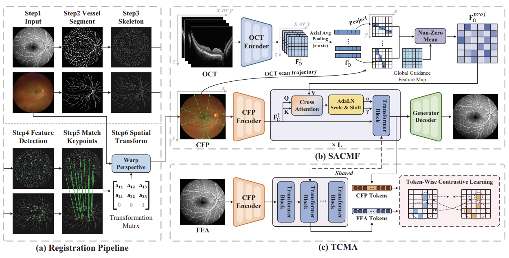
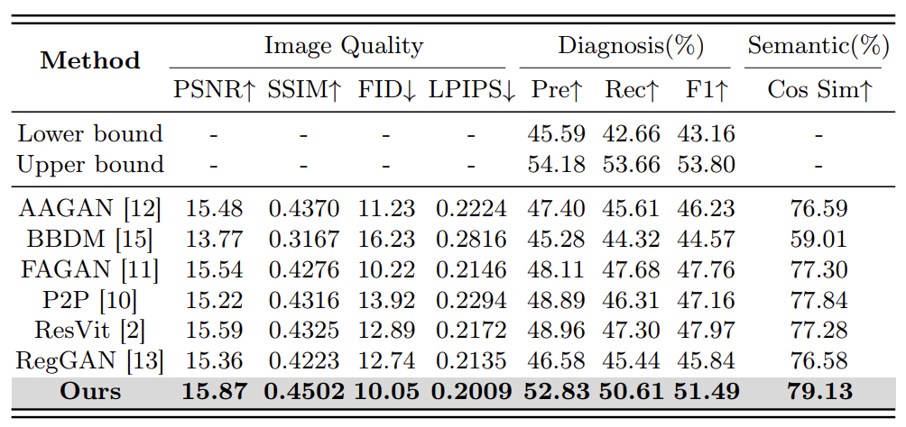
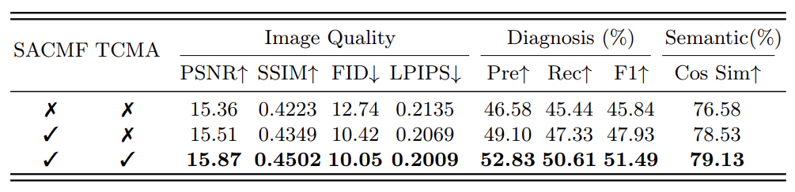

# Propagating Structural Guidance: Synthesizing Fluorescein Angiography from Fundus Images and Sparse OCT Scans


## Model Checkpoint
[OCT Encoder](https://drive.google.com/drive/folders/13sG4KOYbYETdDKyJvIAmcBcXjQANh7Xw?usp=sharing)  
[Generator](https://drive.google.com/drive/folders/13sG4KOYbYETdDKyJvIAmcBcXjQANh7Xw?usp=sharing)


## Quick Stark

### 1. Environment Setup
Create or activate your environment, then install:

```bash
conda create -n ffa_syn python=3.10 -y
conda activate ffa_syn
pip install -r requirements.txt
```


### 2. Train

You need to download pretrained [OCT Encoder](https://drive.google.com/file/d/1ml-qdHOVKYXFHfm4UE7sxkQJyJHWmDqU/view?usp=drive_link)
and place it under `./data`  
Train with a yaml config:

```bash
python train.py --config ./Yaml/CycleGan.yaml
```

### 3. Test

Run inference on `samples.csv` and save generated FFA predictions:

```bash
python test.py \
  --device cuda:0 \
  --ckpt-path ./netG_A2B.pth \
  --csv-path ./data/samples.csv \
  --data-dir ./data \
  --save-image-dir ./outputs/test \
  --batch-size 1 \
  --num-workers 2
```


### 4. Eval

Evaluate generated results against ground-truth FFA images:

```bash
python eval.py \
  --device cuda:0 \
  --ref-image-dir ./data/FFA \
  --fake-image-dir ./outputs/test/FFA
```

Example output:

```text
Evaluation Results
  Reference Dir : ./data/FFA
  Generated Dir : ./outputs/test/FFA
  Device        : cuda:0
  PSNR          : 23.4567
  SSIM x100     : 91.2345
  FID           : 12.3456
  LPIPS x100    : 8.7654
```

## Results
### 1. Comparison of different methods


### 2. Ablation Study

